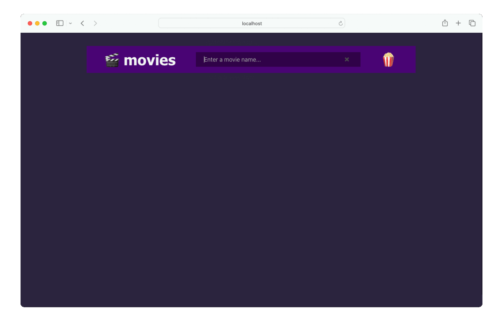

# Movie Search React-Vite Application


## Overview

This is a simple Movie Search App built using React. It allows users to search for movies, view movie details, and add movies to a watchlist. This README provides an overview of the app's features, installation instructions, folder structure, best practices, data flow, encountered problems, and suggestions for improvement.

Here's a short summary of the various technologies and tools you've used in your project:

1. **React**: This application is built using the React library, a popular JavaScript library for creating user interfaces.

2. **Vite**: Vite is used as the build tool and development server for the project.

3. **React Hooks**: React Hooks like `useState`, `useEffect`, and `useRef` are used to manage state and side effects within the components.

4. **Props-management**: `useContext`, `PropTypes`

5. **API Integration**: The app integrates with the OMDB API to fetch movie data and display it to the user.

6. **Styling**: Styling is done using a combination of SCSS (Sass) for stylesheets and the Styled Components library for creating styled React components.

7. **Error Handling**: `Error Handling`
   
These are some of the key technologies and practices employed in the project. It showcases a wide range of tools and techniques used to create a functional and interactive React application.

## React + Vite

This template provides a minimal setup to get React working in Vite with HMR and some ESLint rules.

Currently, two official plugins are available:

- [@vitejs/plugin-react](https://github.com/vitejs/vite-plugin-react/blob/main/packages/plugin-react/README.md) uses [Babel](https://babeljs.io/) for Fast Refresh
- [@vitejs/plugin-react-swc](https://github.com/vitejs/vite-plugin-react-swc) uses [SWC](https://swc.rs/) for Fast Refresh


## Features

- Search for movies by title.
- View detailed information about a selected movie.
- Add movies to a watchlist.
- Rate movies.
- Responsive design for various screen sizes.

## Installation

To run this app locally, follow these steps:

1. Clone the repository:

   ```
   git clone https://github.com/ksachin7/React-projects.git
   ```

2. Navigate to the project directory:

   ```
   cd movie-search-app
   ```

3. Install dependencies:

   ```
   npm install
   ```

4. Start the development server:

   ```
   npm start
   ```

5. Open your web browser and visit `http://localhost:3000` to access the app.

## Folder Structure

```
Movies
│
├── README.md
├── index.html
├── node_modules
├── package-lock.json
├── package.json
├── public
│   └── vite.svg
├── src
│   ├── assets
│   │   ├── images
│   │   │   ├── no-image.jpeg
│   │   │   ├── star.empty.svg
│   │   │   └── star.filled.svg
│   │   └── scss
│   │       ├── App.scss
│   │       ├── MoviesDetails.scss
│   │       ├── MoviesList.scss
│   │       ├── NavBar.scss
│   │       └── index.scss
│   └── components
│       ├── App.jsx
│       ├── common
│       │   ├── Error.jsx
│       │   ├── Loading.jsx
│       │   └── Navbar.jsx
│       ├── hooks
│       │   ├── useLocalStorage.js
│       │   └── useMovies.js
│       ├── main.jsx
│       ├── movie-details
│       │   ├── MoviesDetails.jsx
│       │   ├── SVGStarIcon.jsx
│       │   └── StarRatings.jsx
│       ├── movie-list
│       │   └── MoviesList.jsx
│       └── watched-info
│           ├── WatchedList.jsx
│           └── WatchedSummary.jsx
└── vite.config.js

1190 directories, 8354 files
```

## Best Practices

- Use functional components for UI elements.
- Maintain a clean and organized folder structure.
- Follow a consistent naming convention for components and variables.
- Make use of PropTypes for component prop validation.
- Utilize React hooks (e.g., useState, useEffect) for state management.
- Implement responsive design for different screen sizes using CSS media queries.

## Data Flow

Data is passed through the app using React props and state:

- **Props**: Data is passed from parent components to child components using props. For example, movie details are passed from the `MoviesList` component to the `MovieCard` component as props.

- **State**: Local component state is managed using the `useState` hook. For example, the `MoviesDetails` component manages the state of the selected movie and user ratings.

## Simplifying Props and State Management

To simplify props and state management:

1. Use a state management library like Redux for global state management if the app becomes more complex.

2. Consider using context and the useContext hook for sharing state among components without passing props explicitly.

## Encountered Problems

Some common problems encountered during development:

- Managing component state and props across multiple levels of nesting.

- Handling asynchronous data fetching and updates.

- Implementing responsive design for different screen sizes.

## Things to Avoid

- Avoid excessive nesting of components. Keep component hierarchies shallow and maintain a single source of truth for state whenever possible.

- Avoid overusing React context for global state management in smaller apps.

## How to Make It Even Better

Suggestions for improving the app:

- Implement user authentication to allow users to save their watchlist across sessions.

- Add pagination for search results to handle large datasets efficiently.

- Improve error handling and user feedback for network requests.

- Enhance the user interface with animations and transitions.

- Write comprehensive unit tests and integration tests to ensure app stability.

## License

This project is licensed under the MIT License. See the [LICENSE](LICENSE) file for details.

## Acknowledgments

Thanks to the [OMDb API](http://www.omdbapi.com/) for providing movie data.


